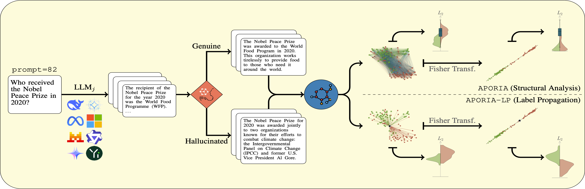

# A Geometric Analysis of Small-sized Language Model Hallucinations

[](https://arxiv.org/abs/2602.14778)
[](https://eonofri04.github.io/APORIA/)
[](LICENSE.txt)  
[](https://github.com/emarich/SOCRATES-300K)
[](https://doi.org/10.5281/zenodo.20256463)
[](https://drive.google.com/file/d/1NXX9g98kqM3KFkta4gy81J3l8ulQWNDq/view?usp=sharing)

This is a companion repository for the ICML 2026 paper:
> A Geometric Analysis of Small-sized Language Model Hallucinations  
> by _Emanuele Ricco, [Elia Onofri](https://www.eliaonofri.it), Lorenzo Cima, Stefano Cresci, and Roberto Di Pietro_.

This repository contains the library, notebooks, and configuration files needed to reproduce every figure and table of the paper.  
The associated dataset, **`SOCRATES-300K`**, is released separately on Zenodo, and the related generation code is available on GitHub (see [*Datasets*](#datasets) below).  
The secondary dataset, **`CoQA-89K`**, is distributed via Google Drive (see [*Datasets*](#datasets) below).





### About the name

The Python package is **`aporia`**, an acronym for *Aggregate Prompt-wise Observation Retrieving Instability via Asymmetry*.  
The word *aporia* (ἀπορία) is a Socratic concept denoting the state of puzzlement that surfaces when a fluent claim is examined and contradicts itself — exactly what a hallucination is in the framing of this paper.  
The acronym mirrors the method's pillars: it operates on *aggregate* distributions over many repeated responses, *prompt-wise* (conditioned on a fixed prompt), as a diagnostic *observation* that retrieves *retrieval instability* (Insight 1 of the Discussion) by exposing the geometric *asymmetry* between genuine and hallucinated response clusters.


## Table of Contents

1. [Overview](#overview)
2. [Repository Layout](#repository-layout)
3. [Installation](#installation)
4. [Library](#library)
5. [Configuration](#configuration)
6. [Notebooks](#notebooks)
7. [Datasets](#datasets)
8. [Reproducing the paper](#reproducing-the-paper)
9. [License](#license)
10. [Citation](#citation)
11. [Acknowledgments](#acknowledgments)
12. [Companion Code](#companion-code)


## Overview

Hallucinations — fluent but factually incorrect responses — pose a major challenge to the reliability of Large Language Models (LLMs), especially in multi-step or agentic settings.  
Existing work largely frames hallucinations as a consequence of missing knowledge; we show instead that, even when the relevant factual knowledge is present, models still produce hallucinated answers, pointing to retrieval instability rather than knowledge gaps.

Building on this observation, we introduce **APORIA** (_Aggregate Prompt-wise Observation Retrieving Instability via Asymmetry_ — the state of puzzlement-in-contradiction that hallucinations embody), a geometric framework that studies repeated responses to the same prompt in sentence-embedding space.
Our central hypothesis is that genuine responses cluster more tightly than hallucinated ones; we empirically validate this and show that, after Fisher projection, the two response classes become consistently separable.

We exploit this geometry in **APORIA-LP**, an efficient label-propagation method that classifies large collections of responses from as few as 30–50 annotations, achieving F1 scores above 90% across ten small-sized LLMs.

To support further research, we release **SOCRATES-300K**, a fully labelled dataset of 300,000 responses, together with the code for both dataset generation and result reproduction.

Our key finding — framing hallucinations from a geometric perspective in the embedding space — complements traditional knowledge-centric and single-response evaluation paradigms, paving the way for further research.


## Repository layout

```
.
├── aporia/         # the library
├── code/           # notebooks reproducing the results from the paper
├── config/         # TOML configs (one per dataset)
├── datasets/       # parquet files (gitignored; see Dataset section)
├── cache/          # cached intermediate results (gitignored)
├── figs/           # final figures
├── pyproject.toml
├── README.md       # this file
├── CITATION.cff
├── CHANGELOG.md
└── LICENSE         # CC BY-NC-SA 4.0
```


## Installation

The project targets Python 3.11+. From a terminal, execute:

```bash
git clone https://github.com/eOnofri04/APORIA.git
cd APORIA

# Create and activate a virtual environment
python -m venv aporia_env
source aporia_env/bin/activate

# Upgrade pip and install in editable mode with notebook extras
pip install --upgrade pip
pip install -e ".[notebook]"

# (Optional) add the UMAP baseline for Appendix F
pip install -e ".[notebook,umap]"
```

Verify the install:

```bash
python -c "import aporia; print(aporia.__version__)"
```

The dataset itself is **not** included in this repository; see [*Datasets*](#datasets) below.

> **Note on figure rendering.** The notebooks set `plt.rcParams['text.usetex'] = True` to produce paper-quality labels.  
> Matplotlib needs a system LaTeX installation for this — typically `texlive-latex-extra` and `dvipng` on Debian/Ubuntu, or `MacTeX`/`TexShop` on macOS. The macros themselves are emitted into the preamble by `aporia.matplotlib_latex_preamble(cfg)`.  
> If you don't have system LaTeX, set `plt.rcParams['text.usetex'] = False` at the top of the notebook — figures will still render, just with matplotlib's default mathtext.


## Library

The library factors the codebase into small, single-purpose modules:

| Module                      | Contents                                                                       |
|-----------------------------|--------------------------------------------------------------------------------|
| `aporia.config`             | TOML loader; `Config`, `DatasetConfig`, `ModelSpec` dataclasses.               |
| `aporia.data`               | Parquet loading, `(X, y)` extraction, stratified splits, balanced subsampling. |
| `aporia.projections`        | `FisherProjection` and baselines (Whitened PCA, Random, Supervised UMAP).      |
| `aporia.structural`         | Distance distributions, Wasserstein vs. null, `run_structural_analysis`.       |
| `aporia.label_propagation`  | `WassersteinLabelPropagator` and the full-study runner.                        |
| `aporia.evaluation`         | `LabelPropagationEvaluator` (metrics, margins, Fisher-agreement).              |
| `aporia.sensitivity`        | $\lambda$ and training-size sensitivity sweeps.                                |
| `aporia.utils`              | Model ordering, prompt picking, metric aggregation, LaTeX-preamble helper.     |
| `aporia.caching`            | Shared parquet/pickle/JSON cache helpers.                                      |

The public API is re-exported from `aporia/__init__.py`, so the typical import is just:

```python
import aporia as ap
cfg = ap.load_config("config/socrates.toml")
df  = ap.load_dataframe(cfg)
```


## Configuration

Everything dataset-specific lives in a TOML file under `config/`. Two configs ship with the repository:

- `config/socrates.toml` — the main SOCRATES-300K dataset (10 LLMs, 200 prompts, 150 responses per prompt).
- `config/coqa_bridge.toml` — the CoQA bridge dataset used in Appendix D to validate the methodology against INSIDE.

Adding a new dataset is a matter of writing one more TOML file; no code changes are required.


## Notebooks

The `code/` folder contains the notebooks that reproduce the paper's results. Each notebook begins with a `chdir`-to-repo-root cell, so it can be launched from either the repo root or from `code/` without breaking relative paths.  
The standard top-of-notebook idiom is:

```python
import aporia as ap
cfg = ap.load_config("config/socrates.toml")
df  = ap.load_dataframe(cfg)
```

The suffix in each filename indicates which experiment is being run.

| Notebook                                       | Main Experiments     | Paper Figures | Paper Tables †   | Main experiment runtime ‡ |
|------------------------------------------------|----------------------|---------------|------------------|--------------------------:|
| `StructuralAnalysis.ipynb`                     | `APORIA`             | 2, 3, 6       | 1, 3, 8, 10, 12  |       7 min               |
| `LabelPropagation.ipynb`                       | `APORIA-LP`          | 8             | 2, 9, 12         |      20 min               |
| `StructuralAnalysis__Sensitivity.ipynb`        | response size sens.  | 7, 10         |                  |  7 h 11 min               |
| `LabelPropagation__LambdaSensitivity.ipynb`    | lambda sens.         | 5             |                  |  5 h 29 min               |
| `LabelPropagation__TrainingSensitivity.ipynb`  | train size sens.     | 4, 9, 11      |                  |  7 h 09 min               |
| `LabelPropagation__ClassifierAblation.ipynb`   | Classifiers ablation |               | 13               |  2 h 51 min               |
| `LabelPropagation__ProjectionAblation.ipynb`   | Projectors ablation  | 12            | 14               | 14 h 05 min               |
| `Pipeline.ipynb` ¶                             | Pipeline overview    | 1             |                  |     < 1 min               |

(†) _Tables 4, 5, 6, 7, 11 are not reproduced by any code_:
 - Table 4 contains results from other literature methods;
 - Table 5 describes the prompts list for `SOCRATES-300K`;
 - Table 6 introduces the classes of disagreement with Claude used as llm-as-a-judge;
 - Table 7 reports the general `SOCRATES-300K` statistics;
 - Table 11 reports the statistics of `CoQA-89K` statistics.

(‡) Runtimes are collected on an Intel Xeon W7-3465X workstation equipped with 28/56 CPU threads (4.8 GHz) and 1 TB RAM and refer to the main experiment cell only (the `ap.run_*` call) when evaluating results on `SOCRATES-300K`.  
The remaining cells in each notebook are post-processing (table assembly and figure drawing) and execute in seconds.  
All intermediate results are cached under `cache/socrates/`, so re-runs are inexpensive.

(¶) `Pipeline.ipynb` imports `_pipeline_helpers.py` from the same directory.  
That file holds the bespoke plotting and projection code for Figure 1 (~800 LoC) which is not reused by any other notebook; keeping it adjacent to the notebook rather than promoting it to `aporia` keeps the library focused on results that generalise across the paper.


## Datasets

`SOCRATES-300K` (300,000 responses; 10 LLMs × 200 prompts × 150 generations) is released on Zenodo:  
[](https://doi.org/10.5281/zenodo.20256463)

The CoQA bridge dataset is distributed at:  
[](https://drive.google.com/file/d/1NXX9g98kqM3KFkta4gy81J3l8ulQWNDq/view?usp=sharing)

Once downloaded, place the parquets within the `datasets/` directory:
```sh
datasets/SOCRATES-300K.parquet
datasets/CoQA-89K.parquet
```

The `datasets/` folder is gitignored so the parquet does not enter the repository.

## Reproducing the paper

1. Install the package (see *Installation*).
2. Download `SOCRATES-300K` from Zenodo into `datasets/`.
3. Open the notebooks in the order listed under *Notebooks*; intermediate results are cached under `cache/socrates/` so reruns are fast.

A full cold-cache reproduction takes approximately **37 hours of sequential CPU time**, dominated by the appendix-level ablations (Figures 4 and 5, Appendices C–F).  
The two main-paper notebooks (`StructuralAnalysis.ipynb` and `LabelPropagation.ipynb`) together take ≈ 30 minutes.  
The ablation notebooks are independent of each other and can be run in parallel on a multi-core machine.
The runtimes per notebook are reported in the table above.


## License

The `APORIA` codebase is released under the [Creative Commons Attribution-NonCommercial-ShareAlike 4.0 International (CC BY-NC-SA 4.0)](https://creativecommons.org/licenses/by-nc-sa/4.0/) license.


You are free to share and adapt the material for non-commercial purposes, provided appropriate credit is given and any derivatives are distributed under the same license.  
The `SOCRATES-300K` dataset is distributed under the same license, with attribution to the model providers acknowledged in Appendix A of the paper.

## Citation

If you use this code or the `SOCRATES-300K` dataset, please cite the associated ICML paper.  
Machine-readable metadata is provided in `CITATION.cff`.  
A BibTeX entry will be added here once the final version of the proceedings are published.

```bibtex
@inproceedings{ricco2026geometric,
  title     = {A Geometric Analysis of Small-sized Language Model Hallucinations},
  author    = {Ricco, Emanuele and Onofri, Elia and Cima, Lorenzo and Cresci, Stefano and Di Pietro, Roberto},
  booktitle = {Proceedings of the 43rd International Conference on Machine Learning (ICML)},
  year      = {2026},
  note      = {TODO: pages, volume, publisher once available}
}
```

> **Affiliations:**  
> E. Ricco, E. Onofri, R. Di Pietro — KAUST–CEMSE, Thuwal, Saudi Arabia  
> L. Cima, S. Cresci — IIT–CNR, Pisa, Italy  
> L. Cima — University of Pisa, Italy

## Acknowledgments

This research is supported by the King Abdullah University of Science and Technology (KAUST) — Center of Excellence for Generative AI, award number 5940.


## Companion code

- **Generation scripts** — the code used to generate `SOCRATES-300K` dataset, tag it under llm-as-a-judge, and extract the embeddings is maintained at:  
  [](https://github.com/emarich/SOCRATES-300K)


## Contact / Issues

For bug reports, questions about the datasets, or collaboration enquiries, please contact:

**[Elia Onofri](https://www.eliaonofri.it)** — `elia[dot]onofri[at]kaust[dot]edu[dot]sa`  
Cybersecurity Research and Innovation Laboratory (CRI-Lab)  
King Abdullah University of Science and Technology (KAUST), Saudi Arabia